# Hospital Patient Record System — SQL Analytics Portfolio Project

An intermediate SQL analytics portfolio project focused on healthcare operations and patient records.  
This project demonstrates database design, data quality validation, multi-table analysis, window functions, and healthcare insight generation using real hospital data.

---

## 📑 Table of Contents

* [Project Overview](#project-overview)
* [Business Objectives](#business-objectives)
* [Dataset Description](#dataset-description)
* [Entity Relationship Diagram (ERD)](#entity-relationship-diagram-erd)
* [Phase 1: Database & Schema Design](#phase-1-database--schema-design)
* [Phase 2: Data Quality & Profiling](#phase-2-data-quality--profiling)
  * [Missing Data Audit](#missing-data-audit)
  * [Orphan Record Detection (Admissions vs. Procedures)](#orphan-record-detection-admissions-vs-procedures)
* [Phase 3: Core Patient Analysis – Data Cleaning & ETL](#phase-3-core-patient-analysis--data-cleaning--etl)
* [Phase 4: Intermediate Clinical & Operational Analysis](#phase-4-intermediate-clinical--operational-analysis)
  * [Departmental Visit Volume](#departmental-visit-volume)
  * [Age Group Segmentation](#age-group-segmentation)
* [Phase 5: Utilization & Mortality Analysis](#phase-5-utilization--mortality-analysis)
  * [Mortality Rates by Age Group](#mortality-rates-by-age-group)
  * [Super-Utilizer Identification](#super-utilizer-identification)
  * [Demographic Utilization Trends](#demographic-utilization-trends)
* [Phase 6: Financial & Insurance Analytics](#phase-6-financial--insurance-analytics)
  * [Payer Market Share by Race](#payer-market-share-by-race)
  * [Insurance Utilization by City](#insurance-utilization-by-city)
  * [Total Claims by Gender](#total-claims-by-gender)
  * [Multi-Insurance Coverage](#multi-insurance-coverage)
* [Phase 7: Clinical Efficiency & LOS Variance](#phase-7-clinical-efficiency--los-variance)
  * [Average LOS per Department](#average-los-per-department)
  * [LOS Outlier Detection](#los-outlier-detection)
* [Phase 8: High-Resource & Seasonality Analysis](#phase-8-high-resource--seasonality-analysis)
  * [Longest Hospital Stays](#longest-hospital-stays)
  * [Monthly Admission Trends](#monthly-admission-trends)
* [Key Insights](#key-insights)
* [Tools & Technologies](#tools--technologies)
* [How to Run the Project](#how-to-run-the-project)
* [Database Backups](#database-backups)

---

## Project Overview

This project builds an analytics layer on top of hospital patient records to support operational reporting and clinical insight generation.  
The analysis mirrors real hospital data workflows handled by healthcare analytics teams.

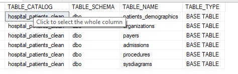

---

## Business Objectives

- Analyze patient demographics and admission behavior  
- Measure departmental utilization and efficiency  
- Identify high-risk and high-resource patients  
- Evaluate insurance usage and claim distributions  
- Translate SQL outputs into actionable healthcare insights  

---

## Dataset Description

The dataset is sourced from Kaggle and represents a hospital patient record system including:

- Patient demographics  
- Admission and discharge records  
- Diagnoses and procedures  
- Department and encounter details  
- Insurance and billing information  

All columns were reviewed prior to analysis to ensure correct interpretation.

---

## Entity Relationship Diagram (ERD)

---

## Phase 1: Database & Schema Design

- Created a dedicated SQL Server database  
- Designed tables aligned with CSV structures  
- Assigned appropriate data types  
- Defined primary keys  
- Loaded all data successfully  

---

## Phase 2: Data Quality & Profiling

### Missing Data Audit

Critical fields such as diagnosis, discharge dates, and insurance attributes were audited for missing values.

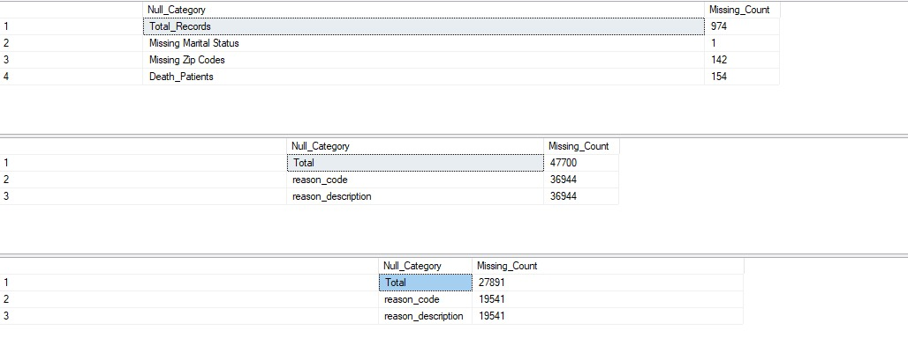

### Orphan Record Detection (Admissions vs. Procedures)

This check identifies **procedures that do not have a matching admission record**, ensuring referential integrity between clinical events.

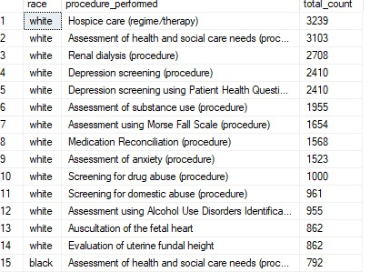

---

## Phase 3: Core Patient Analysis – Data Cleaning & ETL

- Standardized demographic fields  
- Created derived attributes (age group, visit counts)  
- Prepared clean analytical datasets for reporting  

---

## Phase 4: Intermediate Clinical & Operational Analysis

### Departmental Visit Volume

### Age Group Segmentation

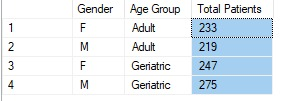

---

## Phase 5: Utilization & Mortality Analysis

### Mortality Rates by Age Group

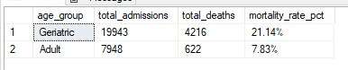

### Super-Utilizer Identification

Patients with more than five admissions were identified as high utilizers.

### Demographic Utilization Trends

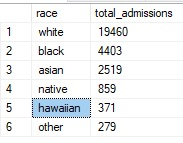

---

## Phase 6: Financial & Insurance Analytics

### Payer Market Share by Race

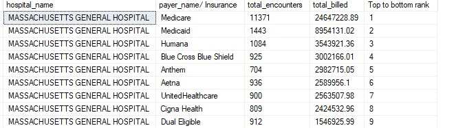

### Insurance Utilization by City

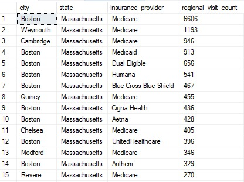

### Total Claims by Gender

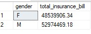

### Multi-Insurance Coverage

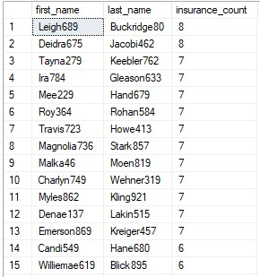

---

## Phase 7: Clinical Efficiency & LOS Variance

### Average LOS per Department

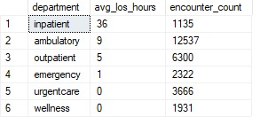

### LOS Outlier Detection

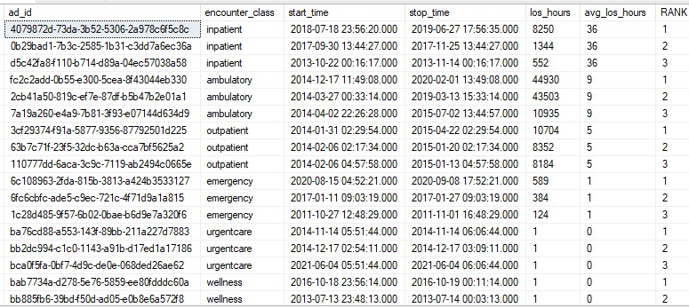

---

## Phase 8: High-Resource & Seasonality Analysis

### Longest Hospital Stays

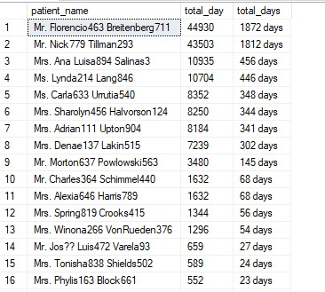

### Monthly Admission Trends

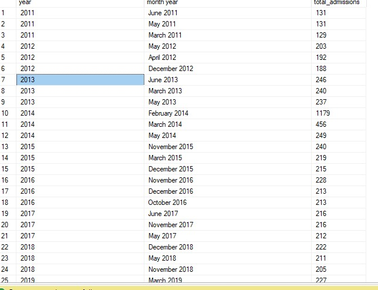

---

## Key Insights

- Geriatric patients show higher mortality and readmission rates  
- Certain departments consistently exhibit longer lengths of stay  
- Admissions demonstrate clear seasonal patterns  
- Insurance utilization varies significantly across demographics  

---

## Tools & Technologies

- Microsoft SQL Server (T-SQL)  
- Kaggle Healthcare Dataset  
- SQL Window Functions & CTEs  
- Git & GitHub  

---

## How to Run the Project

1. Clone the repository  
2. Restore the database or create tables using the schema script  
3. Load CSV files if needed  
4. Execute the SQL analysis scripts  
5. Review outputs and insights  

---

## Database Backups

This project includes **two SQL Server backup files (.bak)**:

- **Uncleaned Database Backup** — raw imported data  
- **Cleaned Database Backup** — validated and transformed data  

These backups allow reviewers to restore and inspect both data states easily without rerunning the full ETL process.

---
