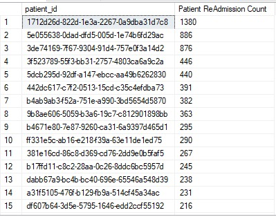

# Hospital Analytics SQL Project


**End-to-end hospital data analytics project** built using **Microsoft SQL Server **.  
This project analyzes patient utilization, outcomes, operational efficiency, and financial performance across multiple analytical phases.

---

## Table of Contents

* [1. Project Overview](#1-project-overview)
* [2. Business Objectives](#2-business-objectives)
* [3. Dataset Description](#3-dataset-description)
* [4. Entity Relationship Diagram (ERD)](#4-entity-relationship-diagram-erd)
* [5. Phase 1: Database & Schema Design](#5-phase-1-database--schema-design)
* [6. Phase 2: Data Quality & Profiling (The Unpivot Method)](#6-phase-2-data-quality--profiling-the-unpivot-method)
    * [6.1 Missing Data Audit](#61-missing-data-audit)
    * [6.2 Orphan Record Detection (Admissions vs. Procedures)](#62-orphan-record-detection)
* [7. Phase 3: Data Cleaning & ETL](#7-phase-3-data-cleaning--etl)
* [8. Phase 4: Descriptive Analytics & Patient Segmentation](#8-phase-4-descriptive-analytics--patient-segmentation)
    * [8.1 Departmental Visit Volume %](#81-departmental-visit-volume)
    * [8.2 Age Group Segmentation (Pediatric, Adult, Geriatric)](#82-age-group-segmentation)
* [9. Phase 5: Utilization & Mortality Analysis](#9-phase-5-utilization--mortality-analysis)
    * [9.1 Mortality Rates by Age Group](#91-mortality-rates-by-age-group)
    * [9.2 Super-Utilizer Identification (>5 Visits)](#92-super-utilizer-identification)
    * [9.3 Demographic Utilization (Race & Gender Admission Trends)](#93-demographic-utilization)
* [10. Phase 6: Financial & Insurance Analytics](#10-phase-6-financial--insurance-analytics)
    * [10.1 Payer Market Share by Race](#101-payer-market-share-by-race)
    * [10.2 Regional Insurance Utilization (City Ranking)](#102-regional-insurance-utilization)
    * [10.3 Insurance Pay-outs by Gender](#103-insurance-pay-outs-by-gender)
    * [10.4 Multi-Insurance Coverage Patients](#104-multi-insurance-coverage-patients)
* [11. Phase 7: Clinical Efficiency & LOS Variance](#11-phase-7-clinical-efficiency--los-variance)
    * [11.1 Average Length of Stay (LOS) per Department](#111-average-length-of-stay-per-department)
    * [11.2 LOS Outlier Detection using Window Functions](#112-los-outlier-detection)
* [12. Phase 8: High-Resource & Seasonality Analysis](#12-phase-8-high-resource--seasonality-analysis)
    * [12.1 High-Resource Patient Ranking (Longest Stays)](#121-high-resource-patient-ranking)
    * [12.2 Monthly Admission Trends & Annual Seasonality](#122-monthly-admission-trends)
* [13. Key Insights](#13-key-insights)
* [14. Tools & Technologies](#14-tools--technologies)
* [15. How to Run the Project](#15-how-to-run-the-project)
  

# Hospital Patient Analytics Project

---

## 1. Project Overview

This project is an end-to-end **SQL-driven healthcare analytics solution** focused on hospital patient data.  
It covers **database design, data quality auditing, ETL, and advanced analytical querying** to extract actionable insights related to utilization, mortality, insurance coverage, and clinical efficiency.

The project follows a **phase-based analytical lifecycle**, mirroring real-world data engineering and analytics workflows.


---

## 2. Business Objectives

- Improve visibility into **patient admission patterns**
- Identify **high-risk and high-resource patients**
- Analyze **mortality and utilization trends**
- Evaluate **insurance and financial coverage disparities**
- Measure **clinical efficiency using Length of Stay (LOS)**

---

## 3. Dataset Description

The dataset simulates hospital operational data and includes:

- Patient demographics
- Admissions and discharge details
- Procedures performed
- Insurance and claim records
- Departmental activity


---

## 4. Entity Relationship Diagram (ERD)

The ERD defines relationships between patients, admissions, procedures, departments, and insurance entities.


---

## 5. Phase 1: Database & Schema Design

- Normalized relational schema
- Primary and foreign key constraints
- Referential integrity enforcement


---

## 6. Phase 2: Data Quality & Profiling (The Unpivot Method)

This phase focuses on identifying structural and content-level data quality issues.

### 6.1 Missing Data Audit

- Column-level null profiling
- Unpivot-based completeness checks


### 6.2 Orphan Record Detection (Admissions vs. Procedures)

- Detection of procedures without valid admissions
- Referential integrity validation


---

## 7. Phase 3: Data Cleaning & ETL

- Removal of invalid records
- Standardization of categorical fields
- Deduplication logic
- Transformation into analytics-ready tables



---

## 8. Phase 4: Descriptive Analytics & Patient Segmentation

### 8.1 Departmental Visit Volume %

- Visit share by department
- Operational load analysis


### 8.2 Age Group Segmentation (Pediatric, Adult, Geriatric)

- Age-based cohort creation
- Utilization trends by age group


---

## 9. Phase 5: Utilization & Mortality Analysis

### 9.1 Mortality Rates by Age Group

- Mortality distribution across age cohorts


### 9.2 Super-Utilizer Identification (>5 Visits)

- Patients with excessive hospital usage


### 9.3 Demographic Utilization (Race & Gender Admission Trends)

- Admission volume by race and gender


---

## 10. Phase 6: Financial & Insurance Analytics

### 10.1 Payer Market Share by Race

- Insurance coverage disparity analysis


### 10.2 Regional Insurance Utilization (City Ranking)

- Geographic insurance usage comparison


### 10.3 Insurance Pay-outs by Gender

- Claim amounts grouped by gender


### 10.4 Multi-Insurance Coverage Patients

- Patients covered by multiple insurers


---

## 11. Phase 7: Clinical Efficiency & LOS Variance

### 11.1 Average Length of Stay (LOS) per Department

- Department-level efficiency analysis


### 11.2 LOS Outlier Detection using Window Functions

- Extreme stay detection using SQL analytics


---

## 12. Phase 8: High-Resource & Seasonality Analysis

### 12.1 High-Resource Patient Ranking (Longest Stays)

- Ranking patients by total LOS


### 12.2 Monthly Admission Trends & Annual Seasonality

- Temporal admission patterns


---

## 13. Key Insights

- Small patient group accounts for disproportionate resource usage
- Mortality risk increases significantly with age
- Insurance coverage varies strongly by race and location
- Certain departments show consistently higher LOS variance

---

## 14. Tools & Technologies

- **SQL (Window Functions, CTEs, Joins)**
- **Relational Database Design**
- **Data Profiling & ETL Techniques**
- **Analytical Query Optimization**
- **Git & GitHub**

---

## 15. How to Run the Project

1. Clone the repository  
2. Load SQL scripts from the `database/` and `query/` folders  
3. Execute schema scripts first  
4. Run analytics queries phase by phase  
5. Review visual outputs in the `images/` directory

---

📁 **Project Structure**
```text
hospital_patients_analysis/
│── database/
│── query/
│── images/
│── README.md
