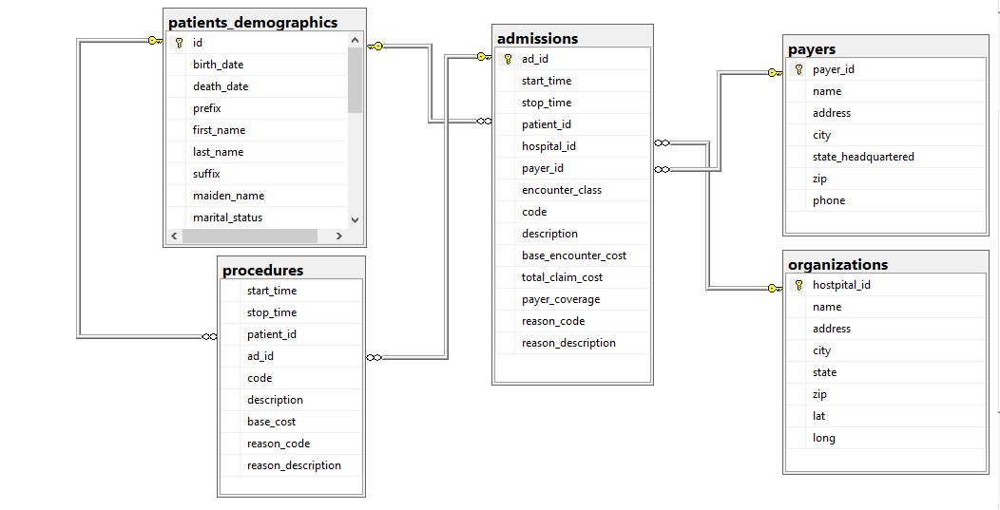
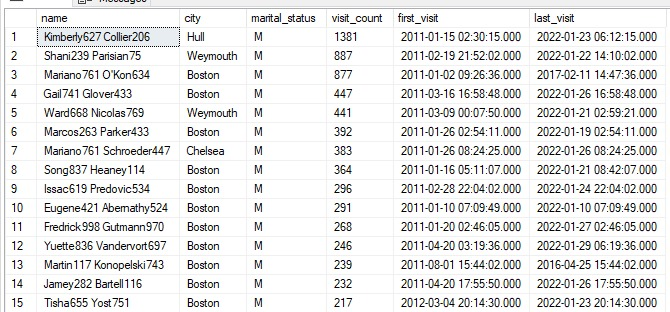

# Hospital PatientAnalysis

An intermediate SQL analytics portfolio project focused on healthcare operations and patient records.  
This project demonstrates database design, data quality validation, multi-table analysis, window functions, and healthcare insight generation using real hospital data.
---

## 📑 Table of Contents

* [Project Overview](#project-overview)
* [Business Objectives](#business-objectives)
* [Dataset Description](#dataset-description)
* [Entity Relationship Diagram (ERD)](#entity-relationship-diagram-erd)
* [Phase 1: Database & Schema Design](#phase-1-database--schema-design)
* [Phase 2: Data Quality & Profiling](#phase-2-data-quality--profiling)
  * [Missing Data Audit](#missing-data-audit)
  * [Orphan Record Detection (Admissions vs. Procedures)](#orphan-record-detection-admissions-vs-procedures)
* [Phase 3: Core Patient Analysis – Data Cleaning & ETL](#phase-3-core-patient-analysis--data-cleaning--etl)
* [Phase 4: Intermediate Clinical & Operational Analysis](#phase-4-intermediate-clinical--operational-analysis)
  * [Departmental Visit Volume](#departmental-visit-volume)
  * [Age Group Segmentation](#age-group-segmentation)
* [Phase 5: Utilization & Mortality Analysis](#phase-5-utilization--mortality-analysis)
  * [Mortality Rates by Age Group](#mortality-rates-by-age-group)
  * [Super-Utilizer Identification](#super-utilizer-identification)
  * [Demographic Utilization Trends](#demographic-utilization-trends)
* [Phase 6: Financial & Insurance Analytics](#phase-6-financial--insurance-analytics)
  * [Payer Market Share by Race](#payer-market-share-by-race)
  * [Insurance Utilization by City](#insurance-utilization-by-city)
  * [Total Claims by Gender](#total-claims-by-gender)
  * [Multi-Insurance Coverage](#multi-insurance-coverage)
* [Phase 7: Clinical Efficiency & LOS Variance](#phase-7-clinical-efficiency--los-variance)
  * [Average LOS per Department](#average-los-per-department)
  * [LOS Outlier Detection](#los-outlier-detection)
* [Phase 8: High-Resource & Seasonality Analysis](#phase-8-high-resource--seasonality-analysis)
  * [Longest Hospital Stays](#longest-hospital-stays)
  * [Monthly Admission Trends](#monthly-admission-trends)
* [Key Insights](#key-insights)
* [Tools & Technologies](#tools--technologies)
* [How to Run the Project](#how-to-run-the-project)
* [Database Backups](#database-backups)

---

## Project Overview

This project builds an analytics layer on top of hospital patient records to support operational reporting and clinical insight generation.  
The analysis mirrors real hospital data workflows handled by healthcare analytics teams.

This project represents a **robust, real-world healthcare analytics exercise by SmartCruxBiz In the Study Group** built on a highly detailed hospital dataset.  
Due to the **breadth, depth, and complexity of the data**, the analytical process evolved beyond a rigid, textbook phase structure.

As the dataset was explored in detail, additional data quality checks, intermediate analyses, and validation steps became necessary.  
For this reason, some phases in this project **do not mirror the original task breakdown exactly**, but instead reflect **practical analytical decisions made during real hospital data exploration**.

To be able to answer real questions by the interviews during the Project Presentation, my approach demonstrates:
- Strong analytical judgment  
- Adaptability to real-world data issues  
- Professional SQL problem-solving aligned with healthcare operations  

Below is the **original phase and task structure** used as the guiding framework for the project.  
**Phase 1: Database Setup Expectations**
- Create a dedicated project database
- Design tables aligned with CSV structures
- Assign appropriate data types
- Define primary keys where applicable
- Load all CSV files successfully
  
**Phase 2: Data Understanding and Validation**
- Review all column definitions
- Identify missing values in critical fields
- Validate patient and visit relationships
- Check for nulls, duplicates, and orphan records

**Phase 3: Core Patient Analysis Tasks**
- Total number of patients
- Patient counts by gender and age group
- Admissions by department
- Admission trends by month and year
  
**Phase 4: Intermediate Clinical and Operational Analysis**
- Departments with highest admissions
- Average length of stay by department
- Most common diagnoses
- Patient readmission count
  
**Phase 5: Multi-Table Analysis**
- Patient ↔ Admission joins
- Admission ↔ Department joins
- Diagnosis ↔ Demographic analysis
  
**Phase 6: Window Function Application**
- Rank departments by patient volume
- Rank entities using analytical functions
- Compare individual patient stays to department averages
  
**Phase 7: Date and Conditional Logic**
- Length of stay calculations
- Stay categorization (short, medium, long)
- Identification of currently admitted patients
  
**Phase 8: Reporting and Insight Questions**
- Top 20 longest hospital stays
- Departments with highest average LOS
- Monthly admission seasonality
- Diagnosis patterns across age groups
  
**Phase 9: Documentation**
- Project overview and healthcare context
- Data dictionary
- Consolidated SQL scripts
- Insight explanations in plain language
  
**Phase 10: Final Submission**
- Clean and readable SQL scripts
- Clear analytical flow
- Portfolio-ready project structure
- GitHub-friendly documentation

---

---

## Business Objectives

- Analyze patient demographics and admission behaviour  
- Measure departmental utilization and efficiency  
- Identify high-risk and high-resource patients  
- Evaluate insurance usage and claim distributions  
- Translate SQL outputs into actionable healthcare insights  

---

## Dataset Description

The dataset is sourced from Kaggle and represents a hospital patient record system including:

- Patient demographics  
- Admission and discharge records  
- Diagnoses and procedures  
- Encounter details  
- Insurance and billing information  

All columns were reviewed prior to analysis to ensure correct interpretation.

---

## Entity Relationship Diagram (ERD)

---

## Phase 1: Database & Schema Design

- Created a dedicated SQL Server database  
- Designed tables aligned with CSV structures  
- Assigned appropriate data types  
- Defined primary keys  
- Loaded all data successfully  

---

## Phase 2: Data Quality & Profiling

### Missing Data Audit

All field were audited for missing values. The following results correspond to Patients_demographics, Procedure and Admission tables respectively.

### Orphan Record Detection (Admissions vs. Procedures)

This check identifies **procedures that do not have a matching admission record**, ensuring referential integrity between clinical events.  **NILL**

---

## Phase 3: Core Patient Analysis – Data Cleaning & ETL

- Standardized demographic fields  
- Created derived attributes (age group, visit counts)  
- Prepared clean analytical datasets for reporting  

---

## Phase 4: Intermediate Clinical & Operational Analysis

### Departmental Visit Volume

### Age Group Segmentation

My logic covered the three age group segmentation. But the analysis shows that the Pediatric (0–17 years) had no encounter.

---

## Phase 5: Utilization & Mortality Analysis

### Mortality Rates by Age Group

### Super-Utilizer Identification

Patients with more than five admissions were identified as high utilizers.

### Demographic Utilization Trends

---

## Phase 6: Financial & Insurance Analytics

### Payer Market Share by Race

### Insurance Utilization by City

### Total Claims by Gender

### Multi-Insurance Coverage

---

## Phase 7: Clinical Efficiency & LOS Variance

### Average LOS per Department

### LOS Outlier Detection

---

## Phase 8: High-Resource & Seasonality Analysis

### Longest Hospital Stays

### Monthly Admission Trends

---

## Key Insights

- Geriatric patients show higher mortality and readmission rates  
- Certain departments consistently exhibit longer lengths of stay  
- Admissions demonstrate clear seasonal patterns  
- Insurance utilization varies significantly across demographics  

---

## Tools & Technologies

- Microsoft SQL Server (T-SQL)  
- Kaggle Healthcare Dataset  
- SQL Window Functions & CTEs  
- Git & GitHub  

---

## How to Run the Project

1. Clone the repository  
2. Restore the database or create tables using the schema script  
3. Load CSV files if needed  
4. Execute the SQL analysis scripts  
5. Review outputs and insights  

---

## Database Backups

This project includes **two SQL Server backup files (.bak)**:

- **Uncleaned Database Backup** — raw imported data  
- **Cleaned Database Backup** — validated and transformed data  

These backups allow reviewers to restore and inspect both data states easily without rerunning the full ETL process.

---
